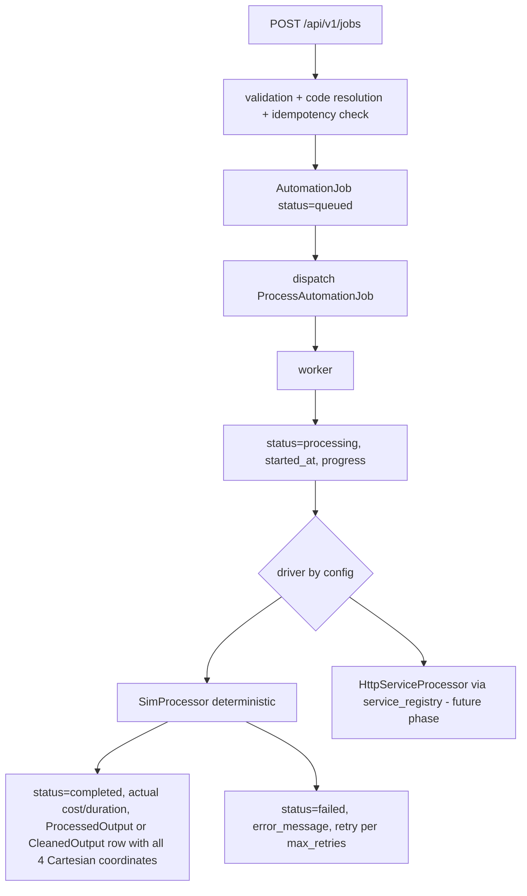

# Core AI Factory — Acceptance Delivery Plan (Product Backlog → Implementation)

> Formal delivery contract for the Web Service. The tester works **black-box**: Input → API → Status → Output → visible data. No knowledge of internal Queue/Worker/DB is required.
>
> Source backlog: 14 Epics / 34 User Stories (see §1). Gap implementation on top of the already-shipped 24-table schema + 23 CRUD resources (see [`core-ai-factory-schema-api.md`](core-ai-factory-schema-api.md)).
>
> **Already delivered** (phases 1–2): auth, upload/download, metadata schemas — the shipped, test-proven surface is mapped scenario-by-scenario in [`e2e-test-coverage.md`](e2e-test-coverage.md). Phases 3–8 below are the remaining work.

## 0. Locked decisions

| Decision | Value |
| --- | --- |
| Processing | Swappable processor: real Laravel Queue + Worker in this service. Default driver = `SimProcessor` (deterministic outputs, used for acceptance testing). Seam for real Whisper/LLM via `service_registry` is a follow-up phase (driver interface only). |
| Auth | Simple API Key: `X-API-Key` header, `api_keys` table (SHA-256 stored), middleware on all `/api/v1` routes. No new composer dependency. Management via artisan commands. |
| Endpoint naming | Keep shipped routes. The story-level names map 1:1 — see §2 naming table. **No `/contents` route**; the contract is documented against `/api/v1/files`. |
| Job status vocabulary | Canonical: `created, queued, processing, completed, failed, cancelled`. `running` is accepted as an alias of `processing` (legacy). No DB constraint exists, so no migration needed for the vocabulary. |
| Action/model addressing | Jobs accept `action_code` (string, e.g. `transcribe`) and `model_code` (e.g. `whisper`), resolved server-side to IDs — black-box friendly. Numeric `action_id`/`model_id` still accepted. |
| Determinism | SimProcessor/SimTrainer/SimEvaluator outputs are pure functions of input content + model code + prompt hash. No randomness, no wall-clock dependence in output content → stable acceptance tests. |
| Immutability | Per `.ai/rules/general.md`: re-runs create new rows (`version_number`, `superseded_by_id`, `is_latest`), never overwrite. Corrections = new version. |
| Tests | Tests use SQLite `:memory:` + `QUEUE_CONNECTION=sync` (already in [`phpunit.xml`](../phpunit.xml)), so E2E runs the real worker inline — deterministic and dependency-free. File storage via `Storage::fake('local')`. |
| Migrations | Must stay SQLite-portable (no raw PG SQL except the existing guarded views migration). |
| Config | New `config/ai-factory.php`: upload rules (allowed mime/extensions, max bytes), processor driver, idempotency TTL, pipeline action wiring. |

## 1. Backlog → implementation mapping

```mermaid
flowchart TD
    U[US-01..05 Upload] --> F[files upload + download]
    U2[US-06..08 Metadata] --> M[metadata query + metadata schemas]
    J[US-09..11 Jobs] --> Q[queue + processor + status history result]
    P[US-12..14 Queue] --> Q
    R[US-15 Results] --> O[outputs + job result endpoint]
    PR[US-16..18 Prompts] --> PM[prompt filters + resolve]
    S[US-19..21 Subtitle] --> PIPE[pipeline actions + sim processor]
    T[US-22..23 Full Text] --> PIPE
    SM[US-24..25 Summary] --> PIPE
    D[US-26..28 Dataset] --> DG[dataset generate + export]
    FT[US-29..31 Training] --> TR[training run]
    B[US-32..34 Benchmark] --> BM[benchmark run]
    L[US-33 lineage EP-13] --> LG[lineage endpoints]
    E[EP-14 E2E] --> E2E[PipelineE2eTest]
    A[US-ALL] --> AUTH[api key auth + idempotency]
```



## 2. Naming map (story → shipped route)

| Story term | Actual endpoint | Entity / table |
| --- | --- | --- |
| Content / `content_id` | `/api/v1/files/{id}` | `SourceFile` / `source_files` |
| Job / `job_id` | `/api/v1/jobs/{id}` | `AutomationJob` / `automation_jobs` |
| Result | `/api/v1/outputs/{id}` (+ `/api/v1/cleaned-outputs`) | `ProcessedOutput`, `CleanedOutput` |
| Prompt | `/api/v1/prompts/{id}` | `MasterPrompt` (git-like: family_id + version + content_hash) |
| Model | `/api/v1/models` | `AiModel` / `models` |
| Dataset | `/api/v1/datasets` | `Dataset` |
| Fine-tuning job | `/api/v1/training-jobs` | `TrainingJob` |
| Fine-tuned model | `/api/v1/trained-models` | `TrainedModel` |
| Benchmark | `/api/v1/benchmark-sessions` + `/api/v1/benchmark-results` | `BenchmarkSession`, `BenchmarkResult` |
| Ground truth | `/api/v1/ground-truth` | `HumanGroundTruth` |

## 3. New / changed API surface

### 3.1 New endpoints

| Method & path | Epic | Purpose |
| --- | --- | --- |
| `POST /api/v1/files/upload` (multipart `file`) | EP-01 | Store binary on `local` disk, compute sha256/size/mime/duration-if-readable, create `SourceFile` (`processing_status=registered`). Returns 201 + file. If same `checksum_sha256` exists → 200 with existing file + `"duplicate": true`. |
| `GET /api/v1/files/{id}/download` | EP-01 | Streams stored file with correct mime + original filename. 410/404 semantics on missing. |
| `GET /api/v1/files?metadata[key]=value` | EP-02 | Filter by JSONB metadata field. |
| `CRUD /api/v1/metadata-schemas` | EP-02 | Schema def: `name`, `scope` (global or per file_type), `schema` JSONB: `{key: {type: string\|integer\|boolean\|object, required: bool, enum?: [], additional?: allow\|reject}}`. Files may reference one; validation enforced on store/update of metadata. |
| `GET /api/v1/jobs/{id}/status` | EP-03 | Lightweight: `status, progress_percent, queued_at, started_at, completed_at, duration_sec, retry_count, error{code,message}\|null`. |
| `GET /api/v1/jobs/{id}/history` | EP-03 | Lifecycle from timestamps: `created_at, queued_at, started_at, completed_at, duration_sec, retry_count, max_retries, error`. |
| `GET /api/v1/jobs/{id}/result` | EP-05 | Returns the job's latest `ProcessedOutput` and/or `CleanedOutput` (by action's output type). 404 if job has none yet. |
| `POST /api/v1/jobs/{id}/cancel` | EP-03 | Only from `queued` → `cancelled`. 409 otherwise. |
| `POST /api/v1/datasets/{id}/generate` | EP-10 | Body: `filter_criteria` (output_type, human_approved, min quality, splits 80/10/10 default). Scans outputs, creates `dataset_items`, updates counters, `status=ready`. 422 if 0 items matched. |
| `GET /api/v1/datasets/{id}/export?format=jsonl` | EP-10 | Streams JSONL: one line per item `{input, output, metadata}` (input/output text from linked outputs, source_file back-reference included). 409 if `status != ready`. |
| `POST /api/v1/training-jobs/{id}/run` | EP-11 | Queues training; 422 unless dataset `status=ready` and `total_items>0`, 409 if job not `queued`. |
| `POST /api/v1/benchmark-sessions/{id}/run` | EP-12 | Queues evaluation over the session's dataset; 422 on missing/incompatible inputs, 409 if not pending. |
| `GET /api/v1/files/{id}/lineage` | EP-13 | Forward tree: file → jobs (incl. descendant chains via `parent_job_id`) → outputs → cleaned outputs → prompts/models used → datasets → training jobs → trained models → benchmark sessions/results. |
| `GET /api/v1/outputs/{id}/lineage` | EP-13 | Reverse: output → its job → parent job chain → source file (+ `chunk_refs`). Same for `cleaned-outputs/{id}/lineage`. |
| `GET /api/v1/prompts/resolve?action_code=...&output_type=...&model_code=...&version=...` | EP-06 | Returns the exact prompt version to use (active, latest matching, or given version). |

### 3.2 Changed endpoints

- `POST /api/v1/jobs` — accepts `action_code`, `model_code`, `prompt_id`, `flow_id`, `service_id`, `source` (default `api`), `is_automatic`; resolves codes→IDs; validates Cartesian coordinates (action must accept the source file's `file_type` via `automation_actions.input_file_types`; actions with `requires_prompt=true` need a resolvable prompt). On success: 201, `status=queued`, dispatches `ProcessAutomationJob` to the queue.
  - **Idempotency**: optional `Idempotency-Key` header (24h TTL per key). Replay returns the original job with 200 + `"idempotent_replay": true`.
- `GET /api/v1/jobs/{id}` (show) — eager-loads action/model/prompt/sourceFile; response includes `error{code,message}` object.
- `POST /api/v1/files` (JSON registration) — keeps working for programmatic registration without binary.
- `POST /api/v1/datasets` — accepts `source_type` (→ `target_output_type_id` by code) and `language`.
- `created_by` on all stores: when not provided, set to the calling API key's id.

## 4. Schema changes (3 new tables, 3 column additions — one migration batch)

1. `api_keys`: `id` UUID pk, `name` (200) unique, `key_hash` (64) unique (SHA-256), `scopes` JSONB nullable (null = all routes), `is_active` bool default true, `last_used_at`, `created_by` UUID nullable, timestamps.
2. `idempotency_keys`: `id` bigserial, `api_key_id` nullable, `key` (128), `route_path` (100), `reference_id` UUID, `response_status` smallint, `expires_at`, `created_at`; unique `(api_key_id, key, route_path)`.
3. `metadata_schemas`: `id` UUID, `name` (200) unique, `scope` (50) default `global` (or a `file_type` value), `schema` JSONB, `is_active` bool, timestamps.
4. `automation_jobs`: + `source` (20) default `api`, + `is_automatic` bool default false.
5. `datasets`: + `language` (10) nullable, + `metadata` JSONB default `{}`.
6. `benchmark_sessions`: + `dataset_id` UUID nullable FK → datasets (US-32).
7. `source_files`: no change (metadata JSONB exists). `processing_status` vocabulary extended in validation only: `+ registered`.

Factories + seeder for new tables. Seeder additions (reference data):
- Models: `whisper` (asr), `qwen` (llm) alongside existing.
- Output types: `raw-subtitle`, `corrected-subtitle`, `full-text` (`summary` exists).
- Actions: `transcribe` (mp3/wav/mp4 → raw-subtitle, `requires_prompt=false`), `correct-subtitle` (input raw-subtitle → cleaned output, requires prompt), `build-full-text` (input full-text/corrected → full-text, requires prompt); `summarize` extended inputs (+ subtitle/full-text).
- Prompt families v1.0 (content_hash) for correct-subtitle, build-full-text, summarize.
- `service_registry`: `whisper-asr` service row (target of the future real driver).

## 5. Processing architecture (EP-03/04/05, EP-07..12)



- `App\Jobs\ProcessAutomationJob` — queued job; `$tries = job.max_retries + 1`; sets `started_at`/`progress_percent`; catches driver exceptions → `failed` with structured error.
- `App\Services\Processing\JobProcessingDriver` (interface) + `SimProcessor` (default, bound by `config('ai-factory.processor')`).
- **SimProcessor contract** (deterministic, per action_code):
  - `transcribe` → `ProcessedOutput` type `raw-subtitle`: `content_text = "SIM_TRANSCRIPT|" . source checksum12`; `content_json = {text, segments: [...]}` (segment count derived from duration/file size, stable).
  - `correct-subtitle` → `CleanedOutput` linked to the raw subtitle `ProcessedOutput` (from parent job): text = corrected variant of input (`"CORRECTED:" . inputHash`), punctuation rule applied.
  - `build-full-text` → `ProcessedOutput` type `full-text` from corrected/raw input.
  - `summarize` → `ProcessedOutput` type `summary` (input-derived).
  - Failure injection (for negative tests): source file binary missing from disk → job `failed` with `error.code=file_unavailable`.
- Every output stores the four coordinates (`source_file_id`, `action_id`, `model_id`, `prompt_id`) — binding rule from [`.ai/rules/general.md`](../.ai/rules/general.md).
- Multi-model/multi-prompt (US-23, US-25): separate jobs ⇒ separate output rows, `is_latest` per family — no overwrite by construction.
- Chain wiring (US-21 tree): correction job carries `parent_job_id = transcription job`; full-text job carries `parent_job_id = correction job`, etc.

## 6. Per-epic acceptance detail (story → contract → test)

Format per story: Request / Expected response / Expected visible state.

### EP-01 Upload (US-01..05)

| Story | Request | Expected | Visible state |
| --- | --- | --- | --- |
| US-01 Word | `POST /files/upload`, file=`sample.docx` | 201 `{id, file_type: docx, mime_type, size, processing_status: registered, created_at, created_by}` | `GET /files/{id}` returns it; `GET /files/{id}/download` returns bytes |
| US-02 PDF | same with `sample.pdf` | 201, `page_count` populated if readable | same |
| US-03 Text | `sample.txt` | 201, `file_type: txt`; `GET /files/{id}` includes text access via download | same |
| US-04 Audio | `sample.mp3` / `sample.wav` | 201, `file_type: mp3/wav`, `duration_seconds` if detectable | same |
| US-05 Video | `sample.mp4` | 201, `file_type: mp4` | same |

Upload rules (config): allowed mime whitelist (docx, pdf, txt, mp3, wav, mp4, doc); max size (default 512MB).
Negative (per §8 matrix): empty file 422, oversized 413, unknown type 415, mime/extension mismatch 415, unicode/XSS filename sanitized + accepted, duplicate checksum 200 + `duplicate: true`.

### EP-02 Metadata (US-06..08)

- US-06: `GET /files/{id}` contract already ≥ `{id, original_filename, file_type, mime_type, file_size_bytes, created_at, processing_status}` (response maps to the story field names in the doc).
- US-07: metadata set on upload (`metadata[speaker]=Ali...`) or `PATCH /files/{id}`; query `GET /files?metadata[language]=fa`.
- US-08: schema created via `/metadata-schemas`; file store/update with `metadata_schema_id` validates: missing required → 422 listing keys; wrong type (`"speaker": 123`) → 422; extra field → 422 when `additional: reject` (default).

### EP-03/04 Jobs & Queue (US-09..14)

- US-09: `POST /jobs {source_file_id, action_code: transcribe, model_code: whisper, source: api, is_automatic: false}` → 201 `{id, status: queued, ...}`. (Story's `content_id`/`action_type`/`model` map to these.)
- US-10: `GET /jobs/{id}/status` shows transitions `queued → processing → completed/failed` (sync queue in tests ⇒ completed immediately; redis in dev ⇒ observable transitions).
- US-11: `GET /jobs/{id}/history` → timestamps + `duration_sec` + `retry_count` + `error`.
- US-12/13: black-box loop `POST job → poll status → completed` — implemented as the E2E test shape.
- US-14: invalid input (corrupted/missing binary) → `{status: failed, error: {code, message}}` visible via status endpoint.
- Idempotency: same `Idempotency-Key` + same body → 200, identical `job_id`, `idempotent_replay: true`; different body + same key → 409.

### EP-05 Result (US-15)

`GET /jobs/{id}/result` returns:
```
{ job_id, source_file_id, source_file_type, action_code, result_type, result: {text, segments/content_json}, model_code, prompt: {id, version, content_hash}, created_at }
```
All from the `ProcessedOutput`/`CleanedOutput` row — nothing exists only in logs.

### EP-06 Prompts (US-16..18)

CRUD exists; additions: list filters (`target_action_code`, `target_output_type_code`, `model_code`, `version`), `GET /prompts/resolve`, version history `GET /prompts/{id}/family` (all versions, git-like). Outputs always reference the exact `prompt_id` (version), never "current" — per [`.ai/rules/models.md`](../.ai/rules/models.md).

### EP-07/08/09 Pipeline (US-19..25)

Chain with black-box requests:

```
POST /files/upload (mp3)
POST /jobs {action_code: transcribe}              -> raw-subtitle output
POST /jobs {action_code: correct-subtitle, parent_job_id: <1>, prompt_id, model_code} -> cleaned output
POST /jobs {action_code: build-full-text, parent_job_id: <2>, prompt_id, model_code}  -> full-text output
POST /jobs {action_code: summarize, parent_job_id: <3>, prompt_id, model_code}        -> summary output
```

- US-21: `GET /files/{id}/lineage` renders the tree Audio → Raw → Corrected → Full → Summary.
- US-23/US-25: repeat steps with different `model_code`/`prompt` → new output rows; lineage shows all variants; old rows keep `is_latest=false` only when superseded in the same family — they are never overwritten.

### EP-10 Dataset (US-26..28)

- US-26: `POST /datasets {name, description, source_type: raw-subtitle, language: fa}` → 201 `status: building`.
- US-27: items via `POST /dataset-items` (existing) with `input_output_id`/`input_cleaned_id`.
- US-28: `POST /datasets/{id}/generate {filter_criteria: {output_types: [raw-subtitle, corrected-subtitle, full-text], human_approved: false, splits: [80,10,10]}}` → 200 `{items_created, train_count, validation_count, test_count, status: ready}`; each item traces to its `source_file_id` + output id. `GET /datasets/{id}/export` → JSONL.

### EP-11 Fine-tuning (US-29..31)

- US-29: `POST /training-jobs {dataset_id, base_model_code: whisper, training_config: {epochs: 3}}` → 201 queued. `POST /training-jobs/{id}/run` → SimTrainer runs (sync in tests).
- US-30: status `queued → running → completed/failed` via show.
- US-31: on completion a `TrainedModel` row exists: `{id, name: whisper-ft-<hash8>, version, base_model_code, training_job_id, status: ready}` — visible via `GET /trained-models` and the training job's response payload.

### EP-12 Benchmark (US-32..34)

- US-32: `POST /benchmark-sessions {name, benchmark_type: quality, dataset_id, judge_model_code, configuration: {}}` → 201 pending. (Ground truth rows optionally linked.)
- US-33: `POST /benchmark-sessions/{id}/run` → SimEvaluator: per item compares candidate output vs ground truth (or vs baseline output) → `BenchmarkResult` rows with real computed similarity.
- US-34: `GET /benchmark-results?benchmark_session_id=...` → each `{benchmark_session_id, candidate_output_id, metrics: {accuracy, wer, quality_rate}, overall_score}`. `quality_rate` 0-100 per [`.ai/rules/database.md`](../.ai/rules/database.md).

### EP-13 Lineage (US-33 in doc / story pair)

- Forward `GET /files/{id}/lineage`: single JSON tree (see §5 shape) covering file → all jobs (chains) → all outputs/cleaned → prompts → models → datasets → training → trained models → benchmarks.
- Reverse `GET /outputs/{id}/lineage` and `/cleaned-outputs/{id}/lineage`: output → job → parent chain → source file (+ `chunk_refs`).
- Depth-bounded recursion (20 levels) to guard against cycles.

### EP-14 E2E (E2E-001)

`tests/Feature/Api/V1/PipelineE2eTest.php` — the 14-step acceptance scenario from the backlog, executed against the real API with sync queue:

1. `POST /files/upload` (real small mp3 fixture, `Storage::fake`) → 201, capture `file_id`
2. `GET /files/{id}` → assert type/metadata/source/created_by/created_at
3. `POST /jobs` transcribe → 201 queued
4. `GET /jobs/{id}/status` → completed (sync) — in async mode the poll-loop helper is exercised
5. `GET /jobs/{id}/result` → raw-subtitle text + segments
6. `POST /jobs` correct-subtitle (parent_job_id, prompt, model) → completed
7. result → corrected subtitle, linked to raw (lineage check)
8. `POST /jobs` build-full-text → completed
9. result → full text
10. `POST /jobs` summarize → completed
11. result → summary
12. `POST /datasets` + `generate` (includes subtitle, corrected, full-text, metadata) → ready; `export` returns JSONL with expected line count
13. `POST /training-jobs` + `run` → completed; `GET /trained-models` shows `ready` model with `training_job_id`
14. `POST /benchmark-sessions` (trained model vs dataset, with ground truth) + `run` → `GET /benchmark-results` shows `metrics{accuracy, wer, quality_rate}` in 0..1 / 0..100

Final assertion: `GET /files/{file_id}/lineage` contains every entity created in steps 3-14.

## 7. Auth contract (applies to every endpoint)

- `X-API-Key` header required on all `/api/v1/*` → 401 `{error: {code: unauthenticated|invalid_api_key}}` otherwise.
- Artisan: `php artisan api-key:create {name} {--scopes=...}` (prints plaintext once), `api-key:list`, `api-key:revoke {id}`.
- Tests: `InteractsWithApiKeys` trait creates a key per test and sets the header.
- `created_by` auto-populated with the key id on all store endpoints.

## 8. Negative test matrix (backlog §6 → tests)

| Area | Cases (expected) |
| --- | --- |
| File | empty file 422; over max size 413; unknown extension 415; declared mime mismatch 415; corrupt docx (bad zip) accepted at upload, fails later as job `failed` (not at upload); weird unicode/XSS filename sanitized; duplicate checksum 200 + `duplicate` |
| Metadata | schema type mismatch 422 with key list; missing required 422; duplicate JSON key (last wins, documented); extra field with `additional: reject` 422; invalid JSON body 422 |
| Job | bad `source_file_id` 422; action for wrong file type 422; unknown `model_code` 422; `requires_prompt` action without resolvable prompt 422; job on soft-deleted file 404; cancel completed job 409 |
| Processing | driver failure (missing binary) → `failed` + error object; `max_retries=1` → `retry_count=1` then failed; idempotency replay 200/same id, conflict 409 |
| Dataset | generate with 0 matches 422; export not ready 409; item with deleted source 404; duplicate item (same output, same dataset) 409 |
| Training | empty dataset 422; unknown `base_model_code` 422; sim failure (config flag) → `failed`; run non-queued job 409 |
| Benchmark | missing dataset 422; dataset output types incompatible with session 422; sim failure → session `failed`; result metrics within bounds |
| Auth | no header 401; wrong key 401; revoked key 401 |

## 9. Definition of Done

Project-level DoD (17 items from the backlog) is the delivery gate. Per-story checklist (20 items from backlog §4) applies to every story; the automated coverage is:

| DoD item | Where proven |
| --- | --- |
| API implemented + documented | endpoints in §3 + this doc + per-endpoint docblocks |
| Validation / success / error codes | §8 negative matrix feature tests |
| Persistence / unique ID / timestamps | CRUD feature tests (existing `CrudApiTestCase`) + lineage assertions |
| Status lifecycle | job status/history tests + E2E |
| Positive + negative + boundary + duplicate | §8 + upload duplicate + idempotency |
| Auth | §7 matrix, applied app-wide |
| Nothing only in logs | `error{code,message}` via status endpoint; results via `/jobs/{id}/result` |
| E2E | `PipelineE2eTest` green |

## 10. Execution order (phases)

1. **Phase 1 — Auth + idempotency infra**: `api_keys`, `idempotency_keys` tables + factories; `config/ai-factory.php`; `EnsureApiKey` middleware wired in [`bootstrap/app.php`](../bootstrap/app.php) on the `api/v1` group; artisan key commands; `created_by` auto-fill; update existing CRUD tests to send the key (shared trait).
2. **Phase 2 — Upload & metadata** (EP-01/02): `files/upload` + `files/{id}/download` + multipart request with rules; `metadata_schemas` CRUD + validation on file store/update; `metadata[key]=` filter; upload negative tests.
3. **Phase 3 — Job engine** (EP-03/04/05): job field migration (`source`, `is_automatic`); code→ID resolution + Cartesian validation in store; `ProcessAutomationJob` queue job; `JobProcessingDriver` + `SimProcessor`; status/history/result/cancel endpoints; idempotency on `POST /jobs`; failure + retry tests.
4. **Phase 4 — Pipeline reference data + actions** (EP-06/07/08/09): seeder additions (whisper/qwen models, raw-subtitle/corrected-subtitle/full-text types, transcribe/correct-subtitle/build-full-text actions, prompt families); prompt filters + `resolve`; multi-model variant tests.
5. **Phase 5 — Dataset generate/export** (EP-10): `datasets` columns migration; `generate` + `export` endpoints; negative tests.
6. **Phase 6 — Training + benchmark execution** (EP-11/12): `benchmark_sessions.dataset_id` migration; `ProcessTrainingJob` + SimTrainer; `ProcessBenchmarkSession` + SimEvaluator; run endpoints; negative tests.
7. **Phase 7 — Lineage** (EP-13): `files/{id}/lineage`, `outputs/{id}/lineage`, `cleaned-outputs/{id}/lineage`; cycle-safe traversal tests.
8. **Phase 8 — E2E + finalization**: `PipelineE2eTest` (14 steps); full suite green; API doc update in this file's §3 (keep as the contract); `vendor/bin/pint --dirty --format agent`; `migrate:fresh --seed` against WSL PostgreSQL sanity check.

## 11. Risks / notes

- WSL PostgreSQL must be started before any pgsql operation (per bootstrap plan).
- `Storage::fake` keeps tests off disk; dev uploads go to `storage/app/private/uploads/...` (local disk).
- Duration/duration metadata for audio is best-effort (no ffmpeg dependency in scope) — `duration_seconds` may be null; SimProcessor falls back to file size.
- Real Whisper/LLM integration is explicitly out of this phase: the driver seam (`JobProcessingDriver` + `service_registry` rows) is the agreed extension point.
- `processing_status` gains `registered` in the validation vocabulary only (no column change).
- All new migrations stay SQLite-portable; views migration stays the only raw-SQL exception.

## 12. Status

- **Phases 1–2 (auth, upload/download, metadata schemas): delivered.** Verified by the 157-test suite; scenario-by-scenario acceptance map (all requests, expected responses, visible state, test anchors) in [`e2e-test-coverage.md`](e2e-test-coverage.md).
- **Phases 3–8: not yet implemented** — the job engine (SimProcessor/queue/status/history/result/cancel, idempotency on jobs), pipeline reference data + prompt resolve, dataset generate/export, training/benchmark run, lineage, and `PipelineE2eTest` remain. The US-09…US-34 scenarios in §6 stay the acceptance contract for when they land.
