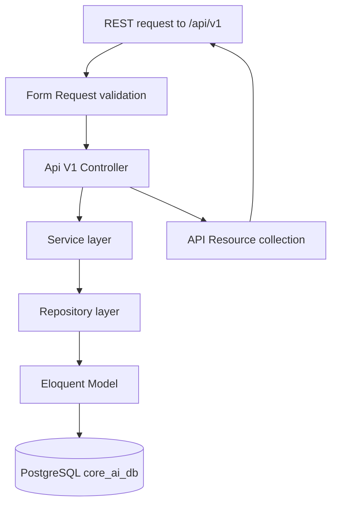

# Core AI Factory — Schema + REST CRUD API Execution Plan

## Goal

Implement the full database design from [`design-deepseek.md`](../design-deepseek.md) (22 tables) **plus** the missing `VectorCollection` entity from the nine required entities in [`.ai/rules/general.md`](../.ai/rules/general.md), then expose every table through a full CRUD REST API with the layering **Controller → Service → Repository (Eloquent)**. No authentication for now.

## Locked decisions

| Decision | Value |
| --- | --- |
| Source of truth for columns | `design-deepseek.md` §3 DDL (PostgreSQL). Deviations below. |
| Tables | 22 from deepseek doc + `vector_collections` + `vector_collection_items` = **24 tables** |
| DB (dev) | PostgreSQL 16 in WSL1 distro `coreaipg` at `127.0.0.1:5432` (role `root`, no password). **Must start before migrating:** `wsl -d coreaipg --user root -- service postgresql start` |
| DB (tests) | SQLite `:memory:` per `phpunit.xml` — all table DDL must be portable (no PG-only SQL in create migrations) |
| Primary keys | UUID via Laravel `HasUuids` for all tables designed as UUID; `$table->id()` (bigint autoincrement) for `output_types`, `automation_actions`, `models`, `service_registry`, `feedback_logs`, `service_call_logs` (designed as SERIAL/BIGSERIAL) |
| UUID generation | In PHP via `HasUuids` — no `gen_random_uuid()` DB defaults (keeps SQLite tests green) |
| Array columns | `input_file_types` and `tags` stored as **JSONB** (Laravel `json`) instead of PG `TEXT[]` — portable + queryable via `whereJsonContains` |
| SoftDeletes | `SourceFile`, `MasterPrompt` (`prompts` table), `ProcessedOutput`, `CleanedOutput` per `.ai/rules/models.md`. All other deletes are hard deletes; reference tables keep their `is_active` flag |
| Model naming | `AiModel` for table `models` (avoids collision with Eloquent base `Model`); `MasterPrompt` for table `prompts` (matches rule naming); rest match table names in PascalCase |
| Enums | No native enum columns — string columns + `Rule::in(...)` validation |
| API prefix | `/api/v1` — `routes/api.php` registered in [`bootstrap/app.php`](../bootstrap/app.php) via `withRouting(api: ..., apiPrefix: 'api')`. No auth middleware (clean skeleton has none) |
| Responses | One Eloquent API Resource per model under `app/Http/Resources/Api/V1/` |
| Validation | One `Store*Request` + `Update*Request` per resource under `app/Http/Requests/Api/V1/` |
| Repositories | Generic `BaseRepository` (all/create/find/findOrThrow/update/delete) + 23 thin concrete repositories |
| Views | The 3 views from deepseek §4 created in one final migration, **guarded to run only on the pgsql driver** (SQLite tests skip). `v_execution_matrix` adapted: `sf.file_type = ANY(aa2.input_file_types::text[])` cast for JSONB arrays |
| Formatting | `vendor/bin/pint --dirty --format agent` before finalizing (mandatory) |
| Out of scope now | Non-CRUD endpoints from deepseek §6 (`/files/{id}/status`, `/lineage`, `/datasets/{id}/export`), queue/worker execution, auth, pgvector/ChromaDB wiring |

## Schema (24 tables, in FK-safe migration order)

Columns per `design-deepseek.md` unless noted. **D vs = deviation from the doc.**

1. `output_types` — reference (bigint id)
2. `automation_actions` — FK → output_types. **D:** `input_file_types` = JSONB
3. `prompts` — self-FK `parent_prompt_id`, FK → output_types, automation_actions. **D:** SoftDeletes
4. `models` — reference (bigint id)
5. `automation_flows` — FK → output_types, automation_actions. **D:** `input_file_types` = JSONB
6. `service_registry` — reference (bigint id)
7. `source_files` — self-FK `superseded_by_id`. **D:** SoftDeletes, JSONB `metadata`
8. `automation_jobs` — FK → source_files, automation_actions, automation_flows, models, prompts (x2), service_registry; self-FKs `parent_job_id`, `rerun_of_job_id`
9. `processed_outputs` — FK → automation_jobs, source_files, output_types, automation_actions, models, prompts; self-FK `superseded_by_id`. **D:** SoftDeletes, JSONB `chunk_refs`/`content_json`
10. `cleaned_outputs` — FK → processed_outputs, source_files, prompts, models; self-FK `superseded_by_id`. **D:** SoftDeletes
11. `human_ground_truth` — FK → source_files, output_types, automation_actions, processed_outputs, cleaned_outputs
12. `benchmark_sessions` — FK → source_files, output_types, automation_actions, models, prompts
13. `benchmark_results` — FK → benchmark_sessions, processed_outputs (x2), cleaned_outputs (x2), human_ground_truth, models (x2), prompts (x2)
14. `datasets` — FK → output_types
15. `dataset_items` — FK → datasets (CASCADE), source_files, processed_outputs, cleaned_outputs, human_ground_truth
16. `training_jobs` — FK → datasets, service_registry
17. `trained_models` — FK → training_jobs; unique(name, version)
18. `model_evaluations` — FK → trained_models (x2), benchmark_sessions, models, prompts
19. `model_releases` — FK → trained_models
20. `release_reports` — FK → model_releases
21. `vector_collections` — **new, designed here** (deepseek doc has no DDL; required entity): `id` UUID, `name` (300), `description`, `vector_db` (50: chromadb/pgvector/qdrant), `external_collection_id` (200), `search_mode` (50, default `hybrid`: lexical/semantic/hybrid), `filter_criteria` JSONB (dynamic-collection metadata filter, e.g. year 1385), `status` (50, default `building`: building/ready/archived), `total_items` int default 0, `is_active` bool, timestamps
22. `vector_collection_items` — **new**: `id` UUID, `vector_collection_id` FK CASCADE, `source_file_id` FK (traceability), `processed_output_id` FK nullable, `cleaned_output_id` FK nullable, `external_vector_id` (200), `chunk_ref` JSONB (second/page level), `metadata` JSONB, `created_at`; indexes on collection_id and source_file_id
23. `feedback_logs` — bigserial; FK → source_files, processed_outputs, cleaned_outputs, trained_models. **D:** add `prompt_id` + `model_code` link per `.ai/rules/database.md` (FeedbackLog ties to prompt-model pairs) — `prompt_id` UUID FK nullable, `model_id` int FK nullable
24. `service_call_logs` — bigserial; FK → service_registry, source_files, automation_jobs

Index strategy: port the plain B-tree + partial indexes from the doc; convert `USING GIN` indexes to plain `->index()` on the JSONB column (SQLite-compatible; GIN added later via a pgsql-guarded statement if needed).

## REST API surface (no auth)

All resources are standard `Route::apiResource` (index/store/show/update/destroy) under `/api/v1`. Destroy semantics follow the SoftDeletes decision.

| Prefix | Resource param | Model | Table | Destroy |
| --- | --- | --- | --- | --- |
| `/files` | files | SourceFile | source_files | soft |
| `/output-types` | outputTypes | OutputType | output_types | hard |
| `/automation-actions` | automationActions | AutomationAction | automation_actions | hard |
| `/prompts` | prompts | MasterPrompt | prompts | soft |
| `/models` | models | AiModel | models | hard |
| `/automation-flows` | automationFlows | AutomationFlow | automation_flows | hard |
| `/services` | services | ServiceRegistry | service_registry | hard |
| `/jobs` | jobs | AutomationJob | automation_jobs | hard |
| `/outputs` | outputs | ProcessedOutput | processed_outputs | soft |
| `/cleaned-outputs` | cleanedOutputs | CleanedOutput | cleaned_outputs | soft |
| `/ground-truth` | groundTruth | HumanGroundTruth | human_ground_truth | hard |
| `/benchmark-sessions` | benchmarkSessions | BenchmarkSession | benchmark_sessions | hard |
| `/benchmark-results` | benchmarkResults | BenchmarkResult | benchmark_results | hard |
| `/datasets` | datasets | Dataset | datasets | hard |
| `/dataset-items` | datasetItems | DatasetItem | dataset_items | hard |
| `/training-jobs` | trainingJobs | TrainingJob | training_jobs | hard |
| `/trained-models` | trainedModels | TrainedModel | trained_models | hard |
| `/model-evaluations` | modelEvaluations | ModelEvaluation | model_evaluations | hard |
| `/model-releases` | modelReleases | ModelRelease | model_releases | hard |
| `/release-reports` | releaseReports | ReleaseReport | release_reports | hard |
| `/vector-collections` | vectorCollections | VectorCollection | vector_collections | hard |
| `/vector-collections/{id}/items` | sub-resource | VectorCollectionItem | vector_collection_items | hard |
| `/feedbacks` | feedbacks | FeedbackLog | feedback_logs | hard |
| `/service-call-logs` | serviceCallLogs | ServiceCallLog | service_call_logs | hard |

= 23 top-level resources (115 routes) + 1 sub-resource (4 routes) ≈ **119 endpoints**.

## Layering

- `app/Http/Controllers/Api/V1/*Controller.php` — thin; resolves service, returns Resource(s). `destroy` returns `null` with 204.
- `app/Services/*Service.php` — constructor-injects its repository; methods `list(int $perPage)`, `create(array)`, `find(string|int)`, `update(string|int, array)`, `delete(string|int)`.
- `app/Repositories/BaseRepository.php` — generic CRUD bound to `$this->model`; `delete()` calls `delete()` vs `forceDelete`/`delete` depending on `SoftDeletes`. 23 concrete repositories each just bind their model (e.g. `protected SourceFile $model` in the constructor).
- `app/Models/*` — `HasUuids` where applicable, `SoftDeletes` where applicable, `casts()` with `array` for all JSONB columns, `fillable` via guarded `[]` with explicit casts (or `fillable` lists — follow existing `User` model convention), relationships for the FK graph (e.g. `ProcessedOutput::job()`, `::sourceFile()`, `::prompt()`, `::model()`; `AutomationJob` hasMany `outputs`).

## Execution sequence (mirrors the todo list)

1. **API routing scaffold** — create `routes/api.php`; register it in [`bootstrap/app.php`](../bootstrap/app.php) `withRouting(api: __DIR__.'/../routes/api.php', apiPrefix: 'api')`.
2. **Migrations — reference tables** (6): output_types, automation_actions, prompts, models, automation_flows, service_registry.
3. **Migrations — core pipeline** (5): source_files, automation_jobs, processed_outputs, cleaned_outputs, human_ground_truth.
4. **Migrations — benchmark + ML lifecycle** (9): benchmark_sessions, benchmark_results, datasets, dataset_items, training_jobs, trained_models, model_evaluations, model_releases, release_reports.
5. **Migrations — vectors + logs** (4): vector_collections, vector_collection_items, feedback_logs, service_call_logs.
6. **Views migration** (1, pgsql-guarded): v_execution_matrix, v_latest_outputs, v_benchmark_comparison.
7. **Models** (24): with UUIDs, SoftDeletes, casts, relationships.
8. **Factories (24) + seeders** — `ReferenceDataSeeder` (output types, actions, models, prompt families with v1.0 versions + hashes, flows, service registry) called from `DatabaseSeeder`; every factory produces valid FK-linked rows.
9. **Repositories** — `BaseRepository` + 23 concrete.
10. **Services** (23).
11. **Form Requests** — Store/Update per resource (required = the doc's NOT NULL columns, types/sizes matched, `Rule::in` for status/type vocabularies).
12. **API Resources** (24) — `toArray` exposing all columns; `with()` eager-loads the key belongsTo (sourceFile, job, prompt, model, action, outputType) for the pipeline entities.
13. **Controllers** (23) + `VectorCollectionItem` sub-resource routes.
14. **Wire `routes/api.php`** — all `apiResource` entries + sub-resource, single `api/v1` group.
15. **Feature tests** — one `tests/Feature/Api/V1/*Test.php` per resource: index 200, store 201 + row exists, show 200, update 200 + persisted, destroy 204 (+ soft-delete assertion for the 4 soft-deletable resources). Uses factories, SQLite.
16. **Verify + finalize** — start WSL PostgreSQL, `php artisan migrate:fresh --seed` against `core_ai_db`, `php artisan test` green, `vendor/bin/pint --dirty --format agent`, commit.

## Risks / notes

- **WSL1 PostgreSQL is not a Windows service** — after a reboot it must be started manually before any pgsql operation (see bootstrap plan "Post-reboot operation").
- Migrations must stay SQLite-portable; the only raw SQL allowed is the pgsql-guarded views migration (and optionally a GIN-index statement, also guarded).
- `feedback_logs` gains `prompt_id`/`model_id` beyond the doc — required by the project rule that FeedbackLog ties to prompt-model pairs.
- The `models` table name vs Eloquent base class is handled by naming the model `AiModel` with `protected $table = 'models'`.
- Design docs at repo root stay untouched.
- No dependency changes (no new composer/npm packages needed — plain Laravel + existing pgsql/predis).
