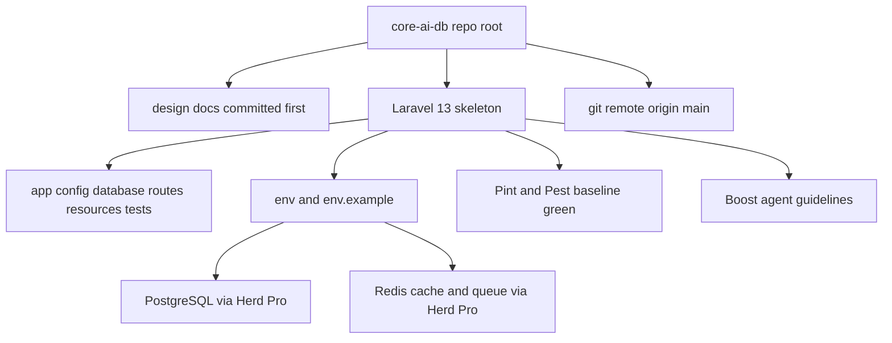

# Laravel 13 Clean Bootstrap - Execution Plan

## Goal

Bring up a clean Laravel 13 application at the workspace root of `core-ai-db`, wired to PostgreSQL and Redis served by Laravel Herd Pro, format and test tooling in place, then commit and connect to a GitHub remote. No starter kit, no auth scaffolding, no domain code yet.

## Locked decisions

| Decision | Value |
| --- | --- |
| Target framework | Laravel 13.x clean skeleton |
| Install location | Repository root `core-ai-db` |
| Starter kit | None, clean skeleton only |
| Database | PostgreSQL, primary connection |
| Cache and queue | Redis |
| AI tooling | Laravel Boost plus project guidelines |
| Formatter | Laravel Pint |
| Local runtime | Originally Laravel Herd Pro; executed as standalone: system PHP 8.5.5, PostgreSQL 16 in WSL1, Redis 5.0.14.1 Windows service (see deviations) |
| Git remote | Created by the user, URL handed over at the remote step |
| Design docs | Stay at repo root and remain tracked in git |

## Target end state



## Execution sequence

### Step 0 - Safety net before touching anything

1. `git init` at the repository root and set branch to `main`.
2. Create a root `.gitignore` that excludes `/vendor`, `/node_modules`, `.env`, `.env.backup`, `/storage/*.key`, build output and editor temp files.
3. Commit only the existing design documents as the first commit. This guarantees the scaffolding step can never destroy them.

### Step 1 - Preflight audit

Run and record exact output of:

- `php -v` - require PHP 8.3 or newer for Laravel 13
- `composer -V` - require Composer 2.x
- `node -v` and `npm -v`
- `laravel -V` - Laravel installer present

If PHP or the installer is missing, install with the php.new PowerShell one-liner, then restart the terminal session so PATH updates.

### Step 2 - Herd Pro services

1. Open the Herd Pro services panel and confirm PostgreSQL and Redis are running.
2. Record host, port, database name, username and password for both.
3. Only if Herd Pro services are unavailable, fall back to native Windows services or Docker Compose and note the deviation in the setup record.

### Step 3 - Installer capability check

Run `laravel new --help` and confirm the exact flags for: database selection, no starter kit, Pest versus PHPUnit, Boost and git. Do not assume flag names carry over from Laravel 12.

### Step 4 - Scaffold Laravel 13

The repository root is not empty, so `laravel new .` will refuse or prompt unpredictably. Use the temp-directory pattern:

1. Run `laravel new` into a temp sibling directory outside the repo, with flags for: no starter kit, PostgreSQL, Pest, Boost.
2. Inspect the temp tree and confirm the desired final file list.
3. Copy everything including hidden files into the repo root using `Get-ChildItem -Force` piped to `Copy-Item -Recurse -Force`. A plain `Copy-Item` with a `*` wildcard silently skips dotfiles such as `.env.example`, `.gitignore`, `.editorconfig` and `.gitattributes`.
4. Explicitly protect the five existing markdown files; skip anything that would overwrite them.
5. Remove the temp directory only after the copy is verified.

### Step 5 - Merge ignore and editor rules

1. Confirm the copied `.gitignore` still ignores `vendor`, `node_modules`, `.env`, logs and build artifacts after the merge.
2. Confirm the design docs and any plan documents are not ignored.
3. Verify `.editorconfig` is present and consistent.

### Step 6 - Environment configuration

In `.env` and mirrored sanitized in `.env.example`:

- `APP_NAME`, `APP_ENV`, `APP_URL`
- `APP_TIMEZONE=Asia/Tehran` and `APP_LOCALE=fa` to match the Persian content domain
- `DB_CONNECTION=pgsql` plus host, port, database, username and password from step 2
- `CACHE_STORE=redis`, `QUEUE_CONNECTION=redis`, session driver decision recorded
- `REDIS_HOST`, `REDIS_PORT`, `REDIS_PASSWORD`

`.env` must never be committed; only `.env.example` with placeholder values.

### Step 7 - Database creation and migration

1. Create the `core_ai_db` database in Herd Pro.
2. Run `php artisan migrate`.
3. Verify with `php artisan db:show` and `php artisan about`.

### Step 8 - Redis verification

1. Confirm `php artisan about` reports redis for cache and queue.
2. Round-trip a cache write and read.
3. Dispatch a trivial queued job and process it once to prove the queue driver works end to end.

### Step 9 - Quality tooling baseline

1. Verify Pint is installed and add `pint.json` using the Laravel preset.
2. Run `vendor/bin/pint --test` then `vendor/bin/pint`.
3. Run `php artisan test` and confirm the default suites pass.

### Step 10 - Frontend baseline

1. Run `npm install` then `npm run build` to prove Vite compiles with no starter kit.
2. Confirm the `composer dev` script starts server, queue listener and Vite together.

### Step 11 - AI agent context

1. Verify Laravel Boost installed.
2. Run `php artisan boost:install` and complete the interactive detection.
3. Add project guidelines under `.ai/guidelines` capturing the non negotiable rules from [`design.md`](../design.md): every stored output must keep a traceable link back to the source file at second or page granularity, and data is never overwritten, only versioned or soft deleted.

### Step 12 - Smoke test

Boot the app on `http://localhost:8000` or link it with Herd, confirm the default route returns 200, then stop the dev processes.

### Step 13 - Skeleton commit

Commit the clean skeleton as the second commit with a descriptive message, keeping the docs commit intact in history.

### Step 14 - Connect the remote

1. Ask the user for the GitHub repository URL.
2. `git remote add origin <url>`, then `git push -u origin main`.
3. Verify with `git remote -v` and a successful push.

### Step 15 - Setup record

Create `plans/laravel-13-bootstrap.md` content as executed, recording exact versions, Herd Pro service settings, environment keys and the remote URL so the environment is reproducible.

## Risk notes

- The scaffold step is the highest risk operation because the repo root already contains the source-of-truth design documents. The docs-first commit in step 0 is the rollback path.
- If PHP on PATH resolves to an older version than Herd ships, Artisan will fail in confusing ways. Always confirm `php -v` resolves to the Herd binary before scaffolding.
- Herd Pro service credentials can differ from defaults; copy them from the panel rather than assuming `postgres` or `root`.
- Boost installer is interactive; if it blocks in a non-interactive shell, fall back to publishing its guidelines manually.

## Setup record (as executed)

### Versions actually installed

| Component | Version | Notes |
| --- | --- | --- |
| PHP | 8.5.5 | `C:\php855` (system PHP, not Herd's; XAMPP PHP 8.2.12 on PATH is too old for Laravel 13) |
| Composer | 2.9.5 | |
| Node | 24.14 | |
| npm | 11.9 | |
| git | 2.53 | |
| laravel/laravel (skeleton) | v13.10.1 | laravel/framework ^13.17, resolved 13.32.0 |
| Vite | 8.3.0 | via `npm run build` |
| laravel/boost | v2.9.0 | dev dependency, plus laravel/mcp 1.0.0 and laravel/roster 1.0.0 |
| predis/predis | v3.6.0 | chosen because no phpredis extension is available for the system PHP 8.5.5 |
| PostgreSQL | 16.15 (Ubuntu 16.15-0ubuntu0.24.04.1) | inside WSL1 distro `coreaipg` (Ubuntu 24.04), 127.0.0.1:5432, trust auth, role `root`, db `core_ai_db` |
| Redis | 5.0.14.1 (tporadowski Windows build) | Windows service "Redis", 127.0.0.1:6138, no password |
| Pint | via Laravel preset | `pint.json` = `{ "preset": "laravel" }` |

### Deviations from the plan

- **Step 4 (scaffold):** `laravel new` is broken on this machine (`laravel/installer` v5.32.0 crashes in `ProjectInstaller.php:69` on the `mkdir` call). Bypassed with `composer create-project laravel/laravel` into a temp sibling directory, then merged into the repo root with `robocopy /E /MOVE` (dotfiles included). The plan's PowerShell `Copy-Item` pattern was not needed because the shell is cmd.exe, not PowerShell.
- **Step 4 (test framework):** PHPUnit kept, Pest not installed (no `--pest` flag was passed, per the clean-skeleton decision). `phpunit.xml` is self-contained: `DB_CONNECTION=sqlite`, `DB_DATABASE=:memory:`, `CACHE_STORE=array`, `SESSION_DRIVER=array`, `QUEUE_CONNECTION=sync`, so `php artisan test` passes without Herd.
- **Step 6 (environment):** timezone is hardcoded as `'Asia/Tehran'` in [`config/app.php`](../config/app.php) (Laravel 13 has no `APP_TIMEZONE` env key); locales come from env: `APP_LOCALE=fa`, `APP_FALLBACK_LOCALE=en`, `APP_FAKER_LOCALE=fa_IR`. `SESSION_DRIVER=redis` added (Herd docs recommend it alongside cache/queue). `REDIS_CLIENT=predis` added to select the pure-PHP client. `extension=pdo_pgsql` was enabled in `C:\php855\php.ini` (the DLL shipped in `C:\php855\ext` but was not enabled; the skeleton only enabled `pdo_mysql` and `pdo_sqlite`).
- **Step 2 (Herd Pro) — CLOSED, not installed:** the machine is a nested Windows VM whose sandbox cannot pass UAC prompts or create Windows services interactively. A `herd --version` success report from the user could not be verified on this machine (no Herd files, no services, no processes anywhere on disk — `where /R C:` found nothing), so it was concluded to have come from a different machine session. The EDB PostgreSQL 18.6-2 Windows installer was investigated exhaustively as a fallback: it is NOT a standard Inno Setup build (full-file scan found no "Inno Setup Setup Data" signature), 7-Zip 26.02 can only read a 13 MB stub cab plus an unparseable 361 MB tail, innoextract 1.9 rejects it, and both `/extract=` switches die silently on the UAC self-elevation. **Windows-native PostgreSQL is definitively not installable from this sandbox.**
- **Step 7 (PostgreSQL) — WSL1 route:** PostgreSQL 16.15 runs inside a **WSL1 Ubuntu 24.04** distro (WSL2 import failed with `HCS_E_HYPERV_NOT_INSTALLED` because the nested VM has no nested virtualization; WSL1 needs no hypervisor and, crucially, **shares the Windows host network namespace**, so the distro's `127.0.0.1:5432` IS Windows' `127.0.0.1:5432` — no port mapping needed).
  - Distro: `coreaipg`, imported via `wsl --import coreaipg C:\Users\s.tabatabaei\wsl-pg\distro <rootfs> --version 1`. Rootfs: `ubuntu-noble-wsl-amd64-24.04lts.rootfs.tar.gz` (340 MB) from `https://cloud-images.ubuntu.com/wsl/releases/24.04/current/`.
  - PostgreSQL installed via `apt-get install postgresql` (16.15, Ubuntu 24.04 package), cluster `16/main` on port 5432.
  - Auth: `pg_hba.conf` set to `trust` for `host all all 127.0.0.1/32` and `::1/128` (dev machine, loopback-only). Role `root` created `SUPERUSER LOGIN` with no password — matches `.env` (`DB_USERNAME=root`, empty `DB_PASSWORD`).
  - Database `core_ai_db` created, owned by `root`. Migrations applied (3 default: users/cache/jobs → 9 tables).
  - Verified end to end from Windows with the app's own PHP: `PDO pgsql:host=127.0.0.1;port=5432` → `CONNECTED: PostgreSQL 16.15`, `php artisan migrate` green, `php artisan db:show` green.
  - **Post-reboot operation:** WSL1 distros are not Windows services. After a VM reboot, start the database with:
    ```
    wsl -d coreaipg --user root -- service postgresql start
    ```
  - Setup script kept at `C:\Users\s.tabatabaei\wsl-pg\pg-setup.sh` (idempotent: pg_hba trust lines, listen_addresses, start cluster, role + db creation, TCP self-check).
- **Step 2/7 (Redis) — standalone Windows service:** tporadowski Windows build 5.0.14.1 installed at `C:\Redis`, running as Windows service "Redis" (auto-start), bound to `127.0.0.1:6138` (matches Herd's non-default Redis port, so `.env` stays Herd-compatible), `maxmemory 256mb` / `allkeys-lru`, no password. This was the only Herd-compatible piece that could be installed from the sandbox (its installer is a standard Inno Setup build).
- **Step 8 (Redis verification):** cache round-trip via `Cache::store('redis')->put/get` → `ok`; queue channel round-trip via raw `lpush`/`rpop` on `queues:default` → payload returned intact. `REDIS_CLIENT=predis` in use.
- **Step 12 (smoke test):** port 8000 was occupied by an unrelated Python 3.13 process (PID 16904), so `php artisan serve --port=8001` was used; welcome route returned 200 with the Laravel wordmark. Dev server stopped afterwards.
- **Step 11 (Boost):** `boost:install` ran non-interactively as `php artisan boost:install --guidelines --skills --mcp --no-interaction`. Boost v2.9.0 writes skills to `.claude/skills/` and `.cursor/skills/`, MCP config to `.mcp.json` (and `.cursor/mcp.json`), and guidelines into `AGENTS.md` + `CLAUDE.md` (identical files). Project rules live in `.ai/rules/` (not `.ai/guidelines` as the plan stated), with an `index.md` mapping globs to rule files. Written by hand in the `RuleRepository` format: `index.md`, `general.md` (`**`), `models.md` (`app/Models/**`), `database.md` (`database/**`), encoding the design.md mandates (Cartesian-product output identity, mandatory second/page-level traceability, immutability, the nine required entities, git-like MasterPrompt versioning, EstimatedCost, QualityRate 0-100, FeedbackLog tied to prompt-model pairs).

### Environment keys (`.env` / `.env.example`)

```
APP_NAME="AI Factory"
APP_URL=http://localhost:8000
APP_LOCALE=fa
APP_FALLBACK_LOCALE=en
APP_FAKER_LOCALE=fa_IR
DB_CONNECTION=pgsql
DB_HOST=127.0.0.1
DB_PORT=5432
DB_DATABASE=core_ai_db
DB_USERNAME=root
DB_PASSWORD=
SESSION_DRIVER=redis
QUEUE_CONNECTION=redis
CACHE_STORE=redis
REDIS_CLIENT=predis
REDIS_HOST=127.0.0.1
REDIS_PASSWORD=null
REDIS_PORT=6138
```

### Commits

| Commit | Message | Content |
| --- | --- | --- |
| `c86702e` | docs: commit design documents and bootstrap plan before scaffolding | design-*.md, laravel.md, plans/ |
| `0fbac7e` | feat: clean Laravel 13 skeleton with PostgreSQL/Redis env, Pint, Boost agent rules | full skeleton, .ai/rules/, Boost artifacts, pint.json |

Note: git identity is still the machine placeholder `Administrator <admin@example.com>` - the user should set `git config user.name` / `user.email` before pushing to GitHub (step 14).

### Open items

- **Step 14 (only remaining):** user hands over the GitHub repo URL; `git remote add origin <url>`, `git push -u origin main`.
- Before pushing: set a real git identity — the machine placeholder `Administrator <admin@example.com>` is currently used.
- Housekeeping (optional): the user-run `C:\Users\s.tabatabaei\pg-install.bat` EDB install produced no verifiable artifacts on this machine and should be deleted; up to 5 stale UAC "consent.exe" prompts from earlier installer attempts may sit on the desktop and should be dismissed.
