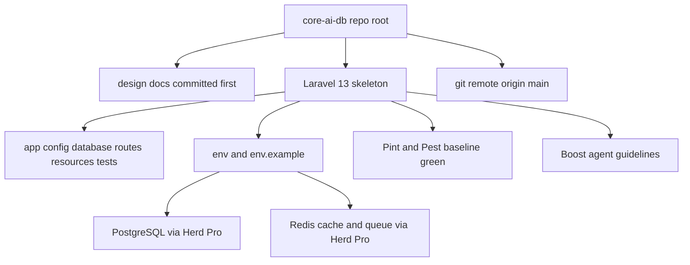

# Laravel 13 Clean Bootstrap - Execution Plan

## Goal

Bring up a clean Laravel 13 application at the workspace root of `core-ai-db`, wired to PostgreSQL and Redis served by Laravel Herd Pro, format and test tooling in place, then commit and connect to a GitHub remote. No starter kit, no auth scaffolding, no domain code yet.

## Locked decisions

| Decision | Value |
| --- | --- |
| Target framework | Laravel 13.x clean skeleton |
| Install location | Repository root `core-ai-db` |
| Starter kit | None, clean skeleton only |
| Database | PostgreSQL, primary connection |
| Cache and queue | Redis |
| AI tooling | Laravel Boost plus project guidelines |
| Formatter | Laravel Pint |
| Local runtime | Laravel Herd Pro on Windows for PHP, PostgreSQL and Redis |
| Git remote | Created by the user, URL handed over at the remote step |
| Design docs | Stay at repo root and remain tracked in git |

## Target end state

## Execution sequence

### Step 0 - Safety net before touching anything

1. `git init` at the repository root and set branch to `main`.
2. Create a root `.gitignore` that excludes `/vendor`, `/node_modules`, `.env`, `.env.backup`, `/storage/*.key`, build output and editor temp files.
3. Commit only the existing design documents as the first commit. This guarantees the scaffolding step can never destroy them.

### Step 1 - Preflight audit

Run and record exact output of:

- `php -v` - require PHP 8.3 or newer for Laravel 13
- `composer -V` - require Composer 2.x
- `node -v` and `npm -v`
- `laravel -V` - Laravel installer present

If PHP or the installer is missing, install with the php.new PowerShell one-liner, then restart the terminal session so PATH updates.

### Step 2 - Herd Pro services

1. Open the Herd Pro services panel and confirm PostgreSQL and Redis are running.
2. Record host, port, database name, username and password for both.
3. Only if Herd Pro services are unavailable, fall back to native Windows services or Docker Compose and note the deviation in the setup record.

### Step 3 - Installer capability check

Run `laravel new --help` and confirm the exact flags for: database selection, no starter kit, Pest versus PHPUnit, Boost and git. Do not assume flag names carry over from Laravel 12.

### Step 4 - Scaffold Laravel 13

The repository root is not empty, so `laravel new .` will refuse or prompt unpredictably. Use the temp-directory pattern:

1. Run `laravel new` into a temp sibling directory outside the repo, with flags for: no starter kit, PostgreSQL, Pest, Boost.
2. Inspect the temp tree and confirm the desired final file list.
3. Copy everything including hidden files into the repo root using `Get-ChildItem -Force` piped to `Copy-Item -Recurse -Force`. A plain `Copy-Item` with a `*` wildcard silently skips dotfiles such as `.env.example`, `.gitignore`, `.editorconfig` and `.gitattributes`.
4. Explicitly protect the five existing markdown files; skip anything that would overwrite them.
5. Remove the temp directory only after the copy is verified.

### Step 5 - Merge ignore and editor rules

1. Confirm the copied `.gitignore` still ignores `vendor`, `node_modules`, `.env`, logs and build artifacts after the merge.
2. Confirm the design docs and any plan documents are not ignored.
3. Verify `.editorconfig` is present and consistent.

### Step 6 - Environment configuration

In `.env` and mirrored sanitized in `.env.example`:

- `APP_NAME`, `APP_ENV`, `APP_URL`
- `APP_TIMEZONE=Asia/Tehran` and `APP_LOCALE=fa` to match the Persian content domain
- `DB_CONNECTION=pgsql` plus host, port, database, username and password from step 2
- `CACHE_STORE=redis`, `QUEUE_CONNECTION=redis`, session driver decision recorded
- `REDIS_HOST`, `REDIS_PORT`, `REDIS_PASSWORD`

`.env` must never be committed; only `.env.example` with placeholder values.

### Step 7 - Database creation and migration

1. Create the `core_ai_db` database in Herd Pro.
2. Run `php artisan migrate`.
3. Verify with `php artisan db:show` and `php artisan about`.

### Step 8 - Redis verification

1. Confirm `php artisan about` reports redis for cache and queue.
2. Round-trip a cache write and read.
3. Dispatch a trivial queued job and process it once to prove the queue driver works end to end.

### Step 9 - Quality tooling baseline

1. Verify Pint is installed and add `pint.json` using the Laravel preset.
2. Run `vendor/bin/pint --test` then `vendor/bin/pint`.
3. Run `php artisan test` and confirm the default suites pass.

### Step 10 - Frontend baseline

1. Run `npm install` then `npm run build` to prove Vite compiles with no starter kit.
2. Confirm the `composer dev` script starts server, queue listener and Vite together.

### Step 11 - AI agent context

1. Verify Laravel Boost installed.
2. Run `php artisan boost:install` and complete the interactive detection.
3. Add project guidelines under `.ai/guidelines` capturing the non negotiable rules from [`design.md`](../design.md): every stored output must keep a traceable link back to the source file at second or page granularity, and data is never overwritten, only versioned or soft deleted.

### Step 12 - Smoke test

Boot the app on `http://localhost:8000` or link it with Herd, confirm the default route returns 200, then stop the dev processes.

### Step 13 - Skeleton commit

Commit the clean skeleton as the second commit with a descriptive message, keeping the docs commit intact in history.

### Step 14 - Connect the remote

1. Ask the user for the GitHub repository URL.
2. `git remote add origin <url>`, then `git push -u origin main`.
3. Verify with `git remote -v` and a successful push.

### Step 15 - Setup record

Create `plans/laravel-13-bootstrap.md` content as executed, recording exact versions, Herd Pro service settings, environment keys and the remote URL so the environment is reproducible.

## Risk notes

- The scaffold step is the highest risk operation because the repo root already contains the source-of-truth design documents. The docs-first commit in step 0 is the rollback path.
- If PHP on PATH resolves to an older version than Herd ships, Artisan will fail in confusing ways. Always confirm `php -v` resolves to the Herd binary before scaffolding.
- Herd Pro service credentials can differ from defaults; copy them from the panel rather than assuming `postgres` or `root`.
- Boost installer is interactive; if it blocks in a non-interactive shell, fall back to publishing its guidelines manually.
